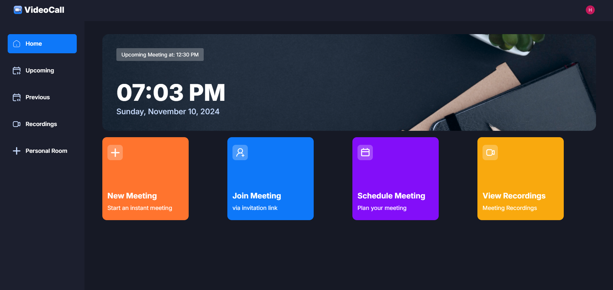
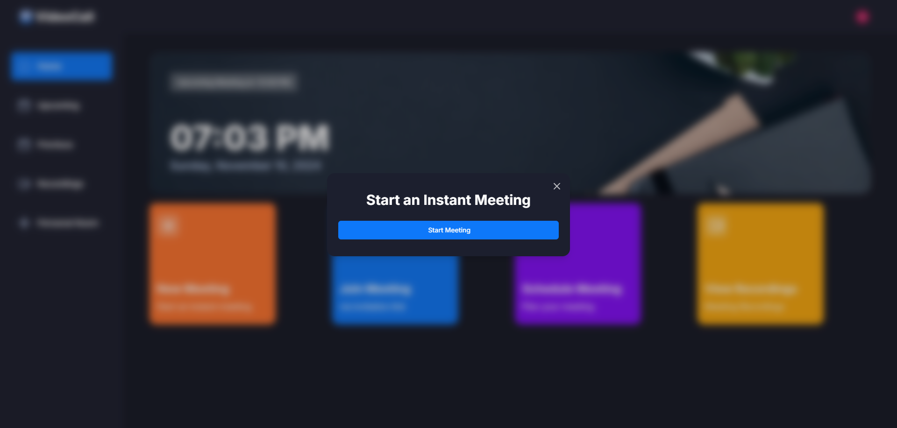
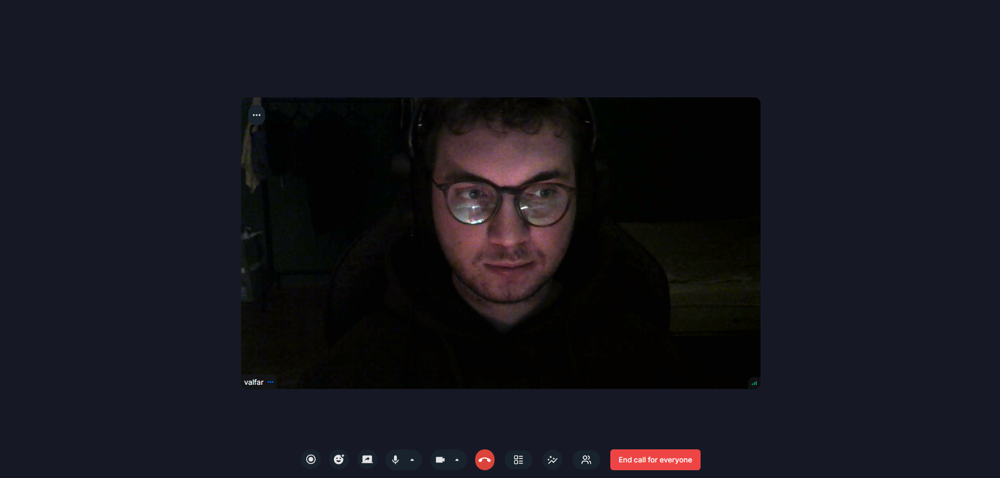

# VideoCall
VideoCall is a modern video conferencing application developed using Clerk and getstream.io. Built on the Next.js framework, this application allows users to make video calls easily and securely.

## Features
- Clerk integration for user authentication and management
- Use of getstream.io for real-time video and audio communication
- Responsive and user-friendly interface
- Room creation and joining features
- Screen sharing
- Chat function

## Technologies
- [Next.js](https://nextjs.org/)
- [React](https://reactjs.org/)
- [Clerk](https://clerk.dev/)
- [GetStream.io](https://getstream.io/)
- [TypeScript](https://www.typescriptlang.org/)

## Live Demo
You can try out the application at: [https://videocall-nine-orpin.vercel.app/](https://videocall-nine-orpin.vercel.app/)

## How to Use

### Authentication
1. Visit [https://videocall-nine-orpin.vercel.app/](https://videocall-nine-orpin.vercel.app/)
2. Sign in using one of the following methods:
   - Google Account
   - LinkedIn Account
   - GitHub Account

### Starting a Meeting
Once logged in, you can start or join meetings easily:


*Dashboard view showing meeting controls and options*


*Click the button*



*Active video call interface with participants*

## Getting Started
Follow these steps to run this project on your local machine:

1. Clone the repository:
```git clone https://github.com/harunsahinol/videocall.git```

2. Navigate to the project directory:
```cd videocall```

3. Install the necessary dependencies:
```npm install```

4. Create a `.env.local` file and add the required environment variables:
```bash
NEXT_PUBLIC_CLERK_PUBLISHABLE_KEY=******
CLERK_SECRET_KEY=********

NEXT_PUBLIC_CLERK_SIGN_IN_URL=/sign-in
NEXT_PUBLIC_CLERK_SIGN_UP_URL=/sign-up


NEXT_PUBLIC_STREAM_API_KEY=*******
STREAM_SECRET_KEY=*******
```

5. Run the application in development mode:
```npm run dev```

6. Open `http://localhost:3000` in your browser to view the application.

## License
This project is licensed under the [MIT License](LICENSE).

## Contact
Harun Şahinol - [GitHub](https://github.com/harunsahinol) - harun.sahinol@outlook.com
